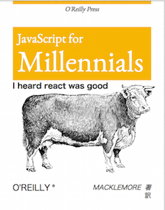

# Style demo for [ProvoJS](http://www.meetup.com/ProvoJS/)

_Started from my [front starter](https://github.com/dinkelburt/front-starter) template._

## Technologies used

### [Webpack](http://webpack.github.io/)
* Takes care of the pre-processing needed to make everything work.
* Compiles all of the Javascript into one file (bundle.js).
* Compiles all of the CSS into one file (bundle.css).
* Provides an in-memory server to make development easier.
### [Babel](https://babeljs.io/)
* Javascript pre-processore that enables ES6/ES2015 & ES7 syntax features (depending on stage, e.g. stage=0) such as `class`, `const`, `let`, `import`, arrow functions, & annotations.
### [PostCSS](https://github.com/postcss/postcss)
* CSS plugin tool that enables the following plugins: `css-modules`, `cssnext`, & `autoprefixer`.
### [css-modules](https://github.com/css-modules/css-modules)
* Makes classes local by default by adding a hash after every class.
* This makes styles more maintainable by allowing more descriptive class names with no worry of having a class name collision.
* Still allows for more global styles if desired.
### [cssnext](http://cssnext.io/)
* Allows use of future & proposed CSS features such as variables & various functions.
### [autoprefixer](https://www.npmjs.com/package/autoprefixer)
* Adds prefixes automatically for CSS features such as `transform`.
### [react-styleable](https://www.npmjs.com/package/react-styleable)
* Makes `css-modules` easier to test.
* Allows overriding of CSS in child React components.
### [React](http://facebook.github.io/react/)

* In all seriousness though, React is cool.
* Makes it easy to create components out of web page objects.
* Very little magic makes it easier to understand.

## Running the app
1. Clone this repo.
2. Run `npm install`
3. Run `npm start`
4. Navigate to [localhost:3000](http://localhost:3000)

## Suggestions For Study
* Check out the links above. Getting the Webpack config right was the hardest part for me, the rest was just from learning syntax that comes with time and experience.
* The entry point is in `lib/index.js` with the main component being in `lib/layout/index.js`.
* Find a local [meetup](http://www.meetup.com) group that can help explain some of the newer technologies.
* Subscribe to [Pluralsight](http://www.pluralsight.com), [Code School](https://www.codeschool.com), [egghead.io](https://www.egghead.io), or [Codecademy](https://www.codecademy.com) for videos and tutorials.
* Google is your friend :-)
